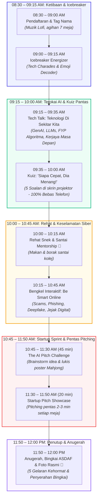

# 🚀 NextGen Tech Summit: Master Event & Facilitator Playbook (All-in-One)

> **Buku Panduan Lengkap Program:** Menggabungkan profil institusi ASDAF, jadual masa, agihan 13 krew UTM, skrip emcee, 5 soalan kuiz pantas, modul aktiviti, dan 3 varian bajet dalam **satu dokumen sahaja**.

---

## 1. Ringkasan Eksekutif Program

- **Nama Program:** NextGen Tech Summit: AI, Innovation & Cyber Resilience
- **Penganjur:** Kumpulan Mahasiswa Universiti Teknologi Malaysia (UTM)
- **Sasaran Peserta:** **47 Murid ASDAF** (Asrama Darul Falah, Bukit Persekutuan, KL) + **6 Staf/Warden Pengiring**
  - *Pecahan:* Tingkatan 1 (6), Tingkatan 2 (6), Tingkatan 3 (10), Tingkatan 4 (15), Tingkatan 5 (5), dan **4 Murid PPKI (Pendidikan Khas)**.
  - *Jantina:* 18 Lelaki, 29 Perempuan.
- **Krew Penganjur:** **13 Orang Mahasiswa UTM** (6 Urusetia Pusat/Pentas + 7 Fasilitator Meja Khusus).
- **Jumlah Keseluruhan Dewan (Pax):** 47 murid + 6 staf ASDAF + 13 krew UTM = **66 Orang** (Tempahan snek: 66–70 pax).
- **Tarikh & Masa:** 8:30 AM – 12:00 PM (3.5 Jam / Separuh Hari).
- **Format Meja:** 7 Meja Kluster Bulat (6–7 murid semeja, campuran jantina & tingkatan).

---

## 2. Background Check & Profil Institusi: Asrama Darul Falah (ASDAF)

### A. Pengenalan & Sejarah Penubuhan
- **Nama Rasmi:** Asrama Darul Falah (ASDAF) PERKIM.
- **Badan Induk:** Pertubuhan Kebajikan Islam Malaysia (PERKIM) Kebangsaan.
- **Tahun Ditubuhkan:** 19 Ogos 1995 (Diasaskan oleh Allahyarham Tuan Haji Yaakob bin Lazim).
- **Lokasi:** No. 535/10, Changkat Persekutuan, Bukit Persekutuan (Federal Hill), 50480 Kuala Lumpur.
  - *Kawasan hijau berbukit yang damai, bersebelahan Bangsar dan KL Sentral.*

### B. Misi, Visi & Kumpulan Sasaran
- **Fokus Utama:** Menyediakan perlindungan kebajikan, asrama penuh, makanan berkhasiat, dan pembiayaan persekolahan untuk **anak-anak masyarakat Orang Asli** dari perkampungan pedalaman di Semenanjung Malaysia (Pahang, Perak, Kelantan, Selangor, Negeri Sembilan, dsb.).
- **Latar Belakang Keluarga:** Anak-anak daripada keluarga fakir miskin pedalaman, anak yatim/piatu, dan keluarga saudara baru (mualaf).
- **Sistem Pendidikan Harian:** Murid-murid ASDAF dihantar bersekolah di sekolah menengah harian sekitar Kuala Lumpur (seperti SMK Bangsar, SMK Vivekananda, dsb.), termasuk 4 orang murid yang mengikuti Program Pendidikan Khas Integrasi (PPKI). Di asrama, mereka menerima kelas fardu ain, tuisyen akademik, dan bengkel jati diri.
- **Pembiayaan Asrama:** Beroperasi 100% berasaskan dana kebajikan, zakat, sumbangan korporat, dan infaq masyarakat prihatin.

### C. Analisis Psikografik & Karakteristik Murid (Untuk Fasilitator UTM)
1. **Ikatan Kekeluargaan Asrama yang Teguh:** Kerana tinggal berjauhan ratusan kilometer dari ibu bapa di kampung pedalaman, anak-anak ASDAF membina rasa persaudaraan yang sangat rapat. Murid senior (Tingkatan 4 & 5) secara semula jadi bertindak sebagai abang dan kakak pelindung kepada adik-adik Tingkatan 1–3.
2. **Sopan, Merendah Diri & Cenderung Pemalu (*Reserved*):** Anak-anak Orang Asli terkenal dengan sifat berbudi bahasa, menghormati tetamu, dan tenang. Namun, mereka mungkin agak pemalu (*introvert*) pada 15 minit pertama jika berhadapan dengan orang luar yang belum dikenali.
3. **Kecenderungan Visual, Seni & Praktikal:** Murid sangat berbakat dalam kemahiran kinestetik, melukis, mengharmonikan warna, dan aktiviti amali berkumpulan berbanding membaca teks teori panjang.
4. **Pendedahan Gajet yang Terkawal:** Kehidupan asrama mengehadkan penggunaan telefon pintar peribadi. Kuiz tanpa telefon (*Fast-Answer Showdown*) dan poster fizikal (*Mahjong canvas*) adalah pendekatan yang paling adil dan menyeronokkan buat mereka.

### D. Kod Etika & Tip Komunikasi Fasilitator UTM
- **Panggilan Mesra:** Panggil murid dengan panggilan mesra *"Adik"* dan perkenalkan krew UTM sebagai *"Abang / Kakak UTM"*. Elakkan berlagak seperti guru yang memeriksa kesalahan.
- **Hargai Identiti Suku Kaum:** Elakkan stereotaip pedalaman. Raikan keunikan budaya dan suku kaum mereka (Semai, Temiar, Jakun dsb.).
- **Inspirasi Menara Gading:** Tunjukkan bahawa pintu universiti (termasuk UTM) sentiasa terbuka luas untuk anak-anak ASDAF melanjutkan pelajaran dalam bidang sains, kejuruteraan, dan teknologi kecerdasan buatan (AI).

---

## 3. Master Timeline & Rajah Aliran (08:30 – 12:00)

---

## 4. Agihan Meja ASDAF (7 Meja Seimbang)

Setiap meja mempunyai **2–3 murid lelaki + 4 murid perempuan**, diketuai murid Tingkatan 4/5:

| Meja | Nama Kumpulan | Jantina | Komposisi Tingkatan | Perhatian Khas |
| :---: | :--- | :---: | :--- | :--- |
| **Meja 1** | *Team CyberTech* | 2 L / 5 P (7 pax) | 1x T5, 2x T4, 1x T3, 1x T2, 1x T1, **1x PPKI** | Fasilitator bantu murid PPKI lukis visual |
| **Meja 2** | *Team AI Smart* | 3 L / 4 P (7 pax) | 1x T5, 2x T4, 2x T3, 1x T2, 1x T1 | Diketuai abang/kakak T5 |
| **Meja 3** | *Team Robocode* | 3 L / 4 P (7 pax) | 1x T5, 2x T4, 1x T3, 1x T2, 1x T1, **1x PPKI** | Fasilitator bantu murid PPKI lukis visual |
| **Meja 4** | *Team FutureNet* | 2 L / 5 P (7 pax) | 1x T5, 3x T4, 1x T3, 1x T2, 1x T1 | Senior T4 & T5 bimbing adik T1/T2 |
| **Meja 5** | *Team Digital Hero* | 3 L / 4 P (7 pax) | 1x T5, 2x T4, 2x T3, 1x T1, **1x PPKI** | Fasilitator bantu murid PPKI lukis visual |
| **Meja 6** | *Team Inovasi AI* | 2 L / 4 P (6 pax) | 2x T4, 2x T3, 1x T2, 1x T1 | Kumpulan kecil dinamik |
| **Meja 7** | *Team Alpha Tech* | 3 L / 3 P (6 pax) | 2x T4, 1x T3, 1x T2, 1x T1, **1x PPKI** | Fasilitator bantu murid PPKI lukis visual |

> **Panduan Murid PPKI (4 Orang):** Ditempatkan di Meja 1, 3, 5, dan 7. Setiap meja ini ada fasilitator UTM khusus yang memberi bimbingan visual dan dorongan peribadi!

---

## 5. Agihan Tugas Mantap 13 Krew UTM (6 Pentas + 7 Meja)

Dengan **13 orang krew**, agihan menjadi **sangat ideal dan teratur**: Setiap meja mempunyai fasilitator khusus (*1 meja : 1 fasilitator*), manakala 6 orang menguruskan operasi pentas dan teknikal.

### A. 6 Urusetia Pusat & Pentas

| No | Jawatan | Peranan Utama | Tugas Semasa Program |
| :---: | :--- | :--- | :--- |
| **1** | **Muhamad Arif bin Johar** | 🎙️ Penceramah Utama | Sampaikan Tech Talk (20 min) & Be Smart Online (30 min) + Ketua Juri Pitching |
| **2** | **Emcee / Pengacara Majlis** | 🎤 Pengemudi Program | Kendali opening, icebreaker, Kuiz Pantas ("3,2,1 Angkat Tangan!"), dan penyampaian hadiah |
| **3** | **Pengurus AV & Teknikal** | 💻 Kawalan Sistem & Skrin | Kawal laptop, slaid PPT kuiz pantas, muzik synthwave/lofi, sound effects & timer |
| **4** | **Ketua Pendaftaran & Jamuan** | 📝 Logistik & Kebajikan | Urus kaunter pendaftaran, agihan tag nama, susun jamuan snek/makan tengah hari |
| **5** | **Jurugambar & Media** | 📸 Media & Dokumentasi | Rakaman video reels/stories, foto kandid aktiviti meja, dan sesi foto rasmi penutup |
| **6** | **Floor Manager / Timekeeper** | ⏱️ Kawalan Masa & Disiplin | Beri isyarat masa kepada Emcee & fasilitator meja, bantu logistik, bantu kordinasi 6 staf ASDAF |

### B. 7 Fasilitator Meja Khusus (1 Meja : 1 Fasilitator UTM)

Setiap fasilitator duduk bersama kumpulan masing-masing sepanjang program:

| No | Fasilitator Meja | Ditugaskan Ke | Fokus Bimbingan Utama |
| :---: | :--- | :---: | :--- |
| **7** | **Fasilitator 1** | **Meja 1** *(Team CyberTech)* | 🧑‍🏫 Bimbingan mesra & sokongan visual inklusif untuk **1 murid PPKI** |
| **8** | **Fasilitator 2** | **Meja 2** *(Team AI Smart)* | 🧑‍🏫 Galakkan perbincangan murid T1–T3, bantu susun idea poster |
| **9** | **Fasilitator 3** | **Meja 3** *(Team Robocode)* | 🧑‍🏫 Bimbingan mesra & sokongan visual inklusif untuk **1 murid PPKI** |
| **10** | **Fasilitator 4** | **Meja 4** *(Team FutureNet)* | 🧑‍🏫 Bantu pembahagian peranan dalam poster (designer, speaker, idea) |
| **11** | **Fasilitator 5** | **Meja 5** *(Team Digital Hero)* | 🧑‍🏫 Bimbingan mesra & sokongan visual inklusif untuk **1 murid PPKI** |
| **12** | **Fasilitator 6** | **Meja 6** *(Team Inovasi AI)* | 🧑‍🏫 Bimbing latihan pitching 2–3 minit sebelum naik pentas |
| **13** | **Fasilitator 7** | **Meja 7** *(Team Alpha Tech)* | 🧑‍🏫 Bimbingan mesra & sokongan visual inklusif untuk **1 murid PPKI** |

*Nota Tambahan: 6 orang staf/warden ASDAF turut dijemput duduk bersama meja untuk membantu kawalan murid dan meraikan aktiviti.*

---

## 6. Modul Aktiviti Ringkas & Playbook

### A. Icebreakers (09:00 – 09:15 AM | 15 Minit)
1. **Teen Tech Charades (8 min):** Wakil meja lakonkan aksi tanpa suara (45 saat), ahli meja teka (+10 mata):
   - *Prompt lakonan:* (1) ChatGPT, (2) TikTok Scroll/FYP, (3) Hacker, (4) Drone Penghantar, (5) Gamer Kalah Main ML, (6) Selfie Filter, (7) Robot AI, (8) Kena Phishing/Scam.
2. **Emoji Tech Decoder (7 min):** Teka istilah teknologi di skrin projektor:
   - 🔒 + 💻 = **Cyber Security**
   - ☁️ + 💾 = **Cloud Storage**
   - 👁️ + 🎭 + 🤖 = **Deepfake**
   - 🎧 + 📊 + 🎁 = **Spotify Wrapped**

---

### B. Kuiz: "Siapa Cepat, Dia Menang!" (09:35 – 10:00 AM | 25 Minit)
*100% Tanpa Telefon. Soalan dipaparkan di projektor. Emcee kira: "3, 2, 1... ANGKAT TANGAN!". Jawapan betul = +20 mata meja & snek segera.*

- **Soalan 1 (Generative AI):** ChatGPT reka fakta palsu dengan nada yakin dipanggil apa?  
  👉 **Jawapan: B) AI Hallucination (Halusinasi AI)**  
  *Penerangan: AI meramal perkataan secara statistik, bukan fakta mutlak.*
- **Soalan 2 (Algoritma Media Sosial):** Kenapa feed TikTok/Reels penuh video sama lepas kita tengok 30 saat?  
  👉 **Jawapan: C) Algoritma cadangan rekod 'watch-time' & minat korang**  
  *Penerangan: Platform mahu kekalkan pengguna selama mungkin (Filter Bubble).*
- **Soalan 3 (Cyber Scam):** Mesej WhatsApp kata menang RM3,000 TnG & minta klik link bit.ly dalam 10 minit?  
  👉 **Jawapan: C) Jangan klik; sekat nombor & abaikan/laporkan**  
  *Penerangan: Taktik 'Urgency' + janji wang adalah asas Phishing Scam.*
- **Soalan 4 (Deepfake):** Video muka/suara artis terkenal tapi bibir kaku ajak labur skim kaya?  
  👉 **Jawapan: A) Deepfake (Synthetic AI Media)**  
  *Penerangan: Dihasilkan model AI Deep Learning yang melatih imej/suara.*
- **Soalan 5 (Digital Footprint):** Amir padam gambar sensitif di medsos selepas 1 jam, adakah ia hilang 100%?  
  👉 **Jawapan: B) Tidak, orang lain mungkin dah screenshot & ada dalam log server**  
  *Penerangan: 'The Internet Never Forgets'—jejak digital adalah kekal.*

---

### C. Hands-on Startup Sprint: "The AI Pitch Challenge" (10:45 – 11:30 AM | 45 Minit)
Setiap meja membina startup teknologi remaja menggunakan 1 kertas Mahjong:
- **Format Poster Mahjong:**
  1. *Nama Startup & Tagline:* (Cth: "ScamShield: Lindungi Poket Anda")
  2. *Masalah Remaja / Komuniti:* Apa masalah yang nak diselesaikan?
  3. *Ciri AI Utama:* Bagaimana AI membantu? (Camera vision, smart chatbot, scanner dsb.)
  4. *Lakaran UI Aplikasi (Post-it notes):* 2–3 skrin telefon ringkas.
  5. *Slogan Promosi.*

---

### D. Startup Pitch Showcase & Anugerah (11:30 – 12:00 PM)
- 7 meja hantar wakil (2–3 minit di pentas).
- Tiada istilah "kalah"—semua meja menerima **Gelaran Kehormat**:
  1. 🦄 *The Unicorn Award* (Inovasi Paling Unik)
  2. 🎨 *Best Visual Design* (Poster Paling Kreatif)
  3. 🎤 *Venture Pitch Masters* (Penyampaian Pentas Paling Berkeyakinan)
  4. 🛡️ *Cyber Ethics & Social Impact* (Penyelesaian Masalah Sosial Terbaik)
  5. ⚙️ *Technical Feasibility Award* (Idea Paling Praktikal & Boleh Dibina)
  6. ⚡ *Fast-Answer Quiz Champion* (Juara Kuiz Pantas)

---

## 7. Ringkasan Skrip Emcee Pentas (Cues Pantas)

- **09:00 AM (Pembukaan):**  
  *"Selamat pagi dan salam NextGen Innovators! Selamat datang ke NextGen Tech Summit! Hari ini korang bukan duduk dengar kuliah bosan, hari ini korang adalah barisan pengasas startup teknologi masa depan!"*
- **09:35 AM (Kuiz Pantas):**  
  *"Simpan telefon dalam poket, kita main guna tangan terpantas korang! Peraturannya: Tangan atas meja... Bila abang kira '3, 2, 1... ANGKAT TANGAN!', siapa laju dia jawab! Jawapan betul dapat 20 markah dan snek segera!"*
- **10:45 AM (Startup Sprint):**  
  *"Dalam masa 45 minit ini, meja korang adalah sebuah syarikat tech! Cipta idea AI yang boleh tolong remaja atau sekolah korang. Fasilitator abang/kakak UTM dah sedia bantu di meja!"*
- **11:50 AM (Penutup & Penyerahan Bingkai ASDAF):**  
  *"Sebagai tanda setinggi-tinggi terima kasih dan kenang-kenangan daripada mahasiswa Universiti Teknologi Malaysia kepada Asrama Darul Falah, pihak kami berbesar hati menyampaikan Bingkai Penghargaan Khas kepada wakil pengurusan ASDAF! Dijemput wakil staf ASDAF ke pentas!"*

---

## 8. Anggaran Bajet: 3 Varian (Siling Modal RM 800.00)

| Item | Varian 1: Super-Lean | Varian 2: Balanced (Disyorkan) ⭐ | Varian 3: Full-Pack (+Makan Tengah Hari) |
| :--- | :---: | :---: | :---: |
| **Snek Rehat Pagi** | RM 155 (Roti bun + kordial) | RM 220 (Roti bakery + kuih + air) | RM 100 (Roti bun + biskut + air) |
| **Makan Tengah Hari** | *Tiada* | *Tiada* | **RM 360 (Nasi Ayam bajet 60 pax)** |
| **Bahan Aktiviti (7 Meja)** | RM 75 (Mahjong, marker, sticky) | RM 85 (Alatan lengkap + gunting) | RM 90 (Alatan lengkap + mounting tape) |
| **Hadiah & Hamper** | RM 0 (Gelaran pentas sahaja) | **RM 90 (3 Hamper + 5 Token kuiz)** | **RM 120 (7 Hamper Meja + Token kuiz)** |
| **Sijil & Banner Bunting** | RM 0 (E-sijil) | **RM 45 (Sijil fizikal 47 murid)** | **RM 75 (Sijil fizikal + Bunting 2x5 kaki)** |
| **Cenderamata Khas ASDAF** | RM 15 (Bingkai A4 Eco-Shop) | RM 20 (Bingkai kaca kemas) | RM 20 (Bingkai premium rasmi UTM) |
| **Percetakan Juri & Rencam** | RM 5 (Print hitam putih) | RM 10 (Print kemas juri) | RM 0 (Termasuk dalam banner) |
| **Kontigensi & Sampah** | RM 20 (Plastik sampah, bateri) | RM 50 (Bateri mic, pembersihan) | RM 35 (Plastik sampah, kecemasan) |
| **JUMLAH KOS** | **RM 270.00** | **RM 520.00** | **RM 800.00** |
| **BAKI DANA SIMPANAN** | **+ RM 530.00** *(Simpanan)* | **+ RM 280.00** *(Simpanan)* | **RM 0.00** *(100% Dimanfaatkan)* |

> 💡 **Syor Pasukan:**
> - Jika ASDAF sediakan makan tengah hari: **Pilih Varian 2 (RM 520)** — Ada hamper, ada sijil bercetak, dan ada baki tabung RM 280.
> - Jika ASDAF tidak sediakan makan tengah hari: **Pilih Varian 3 (RM 800)** — Anak-anak pulang dengan perut kenyang makan nasi bersama fasilitator UTM.

---

## 9. Senarai Semak Logistik Pantas (Hari Kejadian)

- [ ] **Alatan 7 Meja:** 10 keping kertas mahjong, 4 kotak marker pelbagai warna, 7 pek sticky notes neon, gunting & gam stick, masking tape.
- [ ] **Sistem AV & Slaid:** Laptop + projektor HDMI, 2 mikrofon wayarles, speaker audio (playlist lofi & sound effect), slaid PowerPoint 5 soalan kuiz pantas.
- [ ] **Kaunter Pendaftaran:** 55 tag nama kertas lipat (Kump 1–7), pen penanda, borang senarai nama ASDAF.
- [ ] **Kebajikan & Jamuan:** Roti/snek rehat, air kordial/mineral, plastik sampah hitam (3 unit), tisu basah.
- [ ] **Protokol Cenderamata:** 1x Bingkai sijil penghargaan rasmi untuk diserahkan kepada pihak pengurusan ASDAF jam 11:55 AM.