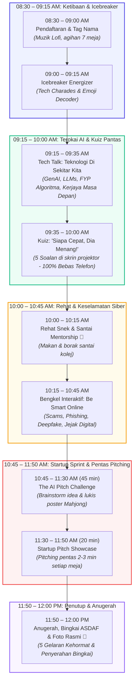

# 🚀 NextGen Celik Digital: Master Event & Facilitator Playbook (All-in-One)

> 🌐 **Laman Web Rasmi (GitHub Pages):** [https://xzrians.github.io/seminar/](https://xzrians.github.io/seminar/)  
> 📖 **Panduan Kemas Kini Wiki (Untuk Manusia & AI):** Rujuk [GUIDELINE.md](file:///c:/Users/lezas/OneDrive/UTM/Courses/seminar/GUIDELINE.md) & [AGENTS.md](file:///c:/Users/lezas/OneDrive/UTM/Courses/seminar/AGENTS.md)  
> *Buku Panduan Lengkap Program: Menggabungkan profil institusi ASDAF, jadual masa, agihan 13 krew UTM, skrip emcee, 5 soalan kuiz pantas, modul aktiviti, dan 3 varian bajet dalam satu dokumen.*

---

## 1. Ringkasan Eksekutif Program

- **Nama Program:** NextGen Celik Digital 2026: Bengkel Santai AI & Keselamatan Siber Remaja
- **Penganjur:** Kumpulan Mahasiswa Universiti Teknologi Malaysia (UTM)
- **Sasaran Peserta:** **47 Murid ASDAF** (Asrama Darul Falah, Bukit Persekutuan, KL) + **6 Staf/Warden Pengiring**
  - *Pecahan:* Tingkatan 1 (6), Tingkatan 2 (6), Tingkatan 3 (10), Tingkatan 4 (15), Tingkatan 5 (5), dan **4 Murid PPKI (Pendidikan Khas)**.
  - *Jantina:* 18 Lelaki, 29 Perempuan.
- **Krew Penganjur:** **13 Orang Mahasiswa UTM** (6 Urusetia Pusat/Pentas + 7 Fasilitator Meja Khusus).
- **Jumlah Keseluruhan Dewan (Pax):** 47 murid + 6 staf ASDAF + 13 krew UTM = **66 Orang** (Tempahan snek: 66–70 pax).
- **Tarikh & Masa:** 8:30 AM – 12:00 PM (3.5 Jam / Separuh Hari).
- **Format Meja:** 7 Meja Kluster Bulat (6–7 murid semeja, campuran jantina & tingkatan).

---

## 2. Background Check & Profil Institusi: Asrama Darul Falah (ASDAF)

### A. Pengenalan & Sejarah Penubuhan
- **Nama Rasmi:** Asrama Darul Falah (ASDAF) PERKIM.
- **Badan Induk:** Pertubuhan Kebajikan Islam Malaysia (PERKIM) Kebangsaan.
- **Tahun Ditubuhkan:** 19 Ogos 1995 (Diasaskan oleh Allahyarham Tuan Haji Yaakob bin Lazim).
- **Lokasi:** No. 535/10, Changkat Persekutuan, Bukit Persekutuan (Federal Hill), 50480 Kuala Lumpur.
  - *Kawasan hijau berbukit yang damai, bersebelahan Bangsar dan KL Sentral.*

### B. Misi, Visi & Kumpulan Sasaran
- **Fokus Utama:** Menyediakan perlindungan kebajikan, asrama penuh, makanan berkhasiat, dan pembiayaan persekolahan untuk **anak-anak masyarakat Orang Asli** dari perkampungan pedalaman di Semenanjung Malaysia (Pahang, Perak, Kelantan, Selangor, Negeri Sembilan, dsb.).
- **Latar Belakang Keluarga:** Anak-anak daripada keluarga fakir miskin pedalaman, anak yatim/piatu, dan keluarga saudara baru (mualaf).
- **Sistem Pendidikan Harian:** Murid-murid ASDAF dihantar bersekolah di sekolah menengah harian sekitar Kuala Lumpur (seperti SMK Bangsar, SMK Vivekananda, dsb.), termasuk 4 orang murid yang mengikuti Program Pendidikan Khas Integrasi (PPKI). Di asrama, mereka menerima kelas fardu ain, tuisyen akademik, dan bengkel jati diri.
- **Pembiayaan Asrama:** Beroperasi 100% berasaskan dana kebajikan, zakat, sumbangan korporat, dan infaq masyarakat prihatin.

### C. Analisis Psikografik & Karakteristik Murid (Untuk Fasilitator UTM)
1. **Ikatan Kekeluargaan Asrama yang Teguh:** Kerana tinggal berjauhan ratusan kilometer dari ibu bapa di kampung pedalaman, anak-anak ASDAF membina rasa persaudaraan yang sangat rapat. Murid senior (Tingkatan 4 & 5) secara semula jadi bertindak sebagai abang dan kakak pelindung kepada adik-adik Tingkatan 1–3.
2. **Sopan, Merendah Diri & Cenderung Pemalu (*Reserved*):** Anak-anak Orang Asli terkenal dengan sifat berbudi bahasa, menghormati tetamu, dan tenang. Namun, mereka mungkin agak pemalu (*introvert*) pada 15 minit pertama jika berhadapan dengan orang luar yang belum dikenali.
3. **Kecenderungan Visual, Seni & Praktikal:** Murid sangat berbakat dalam kemahiran kinestetik, melukis, mengharmonikan warna, dan aktiviti amali berkumpulan berbanding membaca teks teori panjang.
4. **Pendedahan Gajet yang Terkawal:** Kehidupan asrama mengehadkan penggunaan telefon pintar peribadi. Kuiz tanpa telefon (*Fast-Answer Showdown*) dan poster fizikal (*Mahjong canvas*) adalah pendekatan yang paling adil dan menyeronokkan buat mereka.

### D. Kod Etika & Tip Komunikasi Fasilitator UTM
- **Panggilan Mesra:** Panggil murid dengan panggilan mesra *"Adik"* dan perkenalkan krew UTM sebagai *"Abang / Kakak UTM"*. Elakkan berlagak seperti guru yang memeriksa kesalahan.
- **Hargai Identiti Suku Kaum:** Elakkan stereotaip pedalaman. Raikan keunikan budaya dan suku kaum mereka (Semai, Temiar, Jakun dsb.).
- **Inspirasi Menara Gading:** Tunjukkan bahawa pintu universiti (termasuk UTM) sentiasa terbuka luas untuk anak-anak ASDAF melanjutkan pelajaran dalam bidang sains, kejuruteraan, dan teknologi kecerdasan buatan (AI).

---

## 3. Master Timeline & Rajah Aliran (08:30 – 12:00)

---

## 4. Agihan Meja ASDAF (7 Meja Seimbang)

Setiap meja mempunyai **2–3 murid lelaki + 4 murid perempuan**, diketuai murid Tingkatan 4/5:

| Meja | Nama Kumpulan | Jantina | Komposisi Tingkatan | Perhatian Khas |
| :---: | :--- | :---: | :--- | :--- |
| **Meja 1** | *Team CyberTech* | 2 L / 5 P (7 pax) | 1x T5, 2x T4, 1x T3, 1x T2, 1x T1, **1x PPKI** | Fasilitator bantu murid PPKI lukis visual |
| **Meja 2** | *Team AI Smart* | 3 L / 4 P (7 pax) | 1x T5, 2x T4, 2x T3, 1x T2, 1x T1 | Diketuai abang/kakak T5 |
| **Meja 3** | *Team Robocode* | 3 L / 4 P (7 pax) | 1x T5, 2x T4, 1x T3, 1x T2, 1x T1, **1x PPKI** | Fasilitator bantu murid PPKI lukis visual |
| **Meja 4** | *Team FutureNet* | 2 L / 5 P (7 pax) | 1x T5, 3x T4, 1x T3, 1x T2, 1x T1 | Senior T4 & T5 bimbing adik T1/T2 |
| **Meja 5** | *Team Digital Hero* | 3 L / 4 P (7 pax) | 1x T5, 2x T4, 2x T3, 1x T1, **1x PPKI** | Fasilitator bantu murid PPKI lukis visual |
| **Meja 6** | *Team Inovasi AI* | 2 L / 4 P (6 pax) | 2x T4, 2x T3, 1x T2, 1x T1 | Kumpulan kecil dinamik |
| **Meja 7** | *Team Alpha Tech* | 3 L / 3 P (6 pax) | 2x T4, 1x T3, 1x T2, 1x T1, **1x PPKI** | Fasilitator bantu murid PPKI lukis visual |

> **Panduan Murid PPKI (4 Orang):** Ditempatkan di Meja 1, 3, 5, dan 7. Setiap meja ini ada fasilitator UTM khusus yang memberi bimbingan visual dan dorongan peribadi!

---

## 5. Agihan Tugas Mantap 13 Krew UTM (6 Pentas + 7 Meja)

Dengan **13 orang krew**, agihan menjadi **sangat ideal dan teratur**: Setiap meja mempunyai fasilitator khusus (*1 meja : 1 fasilitator*), manakala 6 orang menguruskan operasi pentas dan teknikal.

### A. 6 Urusetia Pusat & Pentas

| No | Jawatan | Peranan Utama | Tugas Semasa Program |
| :---: | :--- | :--- | :--- |
| **1** | **Muhamad Arif bin Johar** | 🎙️ Penceramah Utama | Sampaikan Tech Talk (20 min) & Be Smart Online (30 min) + Ketua Juri Pitching |
| **2** | **Emcee / Pengacara Majlis** | 🎤 Pengemudi Program | Kendali opening, icebreaker, Kuiz Pantas ("3,2,1 Angkat Tangan!"), dan penyampaian hadiah |
| **3** | **Pengurus AV & Teknikal** | 💻 Kawalan Sistem & Skrin | Kawal laptop, slaid PPT kuiz pantas, muzik synthwave/lofi, sound effects & timer |
| **4** | **Ketua Pendaftaran & Jamuan** | 📝 Logistik & Kebajikan | Urus kaunter pendaftaran, agihan tag nama, susun jamuan snek/makan tengah hari |
| **5** | **Jurugambar & Media** | 📸 Media & Dokumentasi | Rakaman video reels/stories, foto kandid aktiviti meja, dan sesi foto rasmi penutup |
| **6** | **Floor Manager / Timekeeper** | ⏱️ Kawalan Masa & Disiplin | Beri isyarat masa kepada Emcee & fasilitator meja, bantu logistik, bantu kordinasi 6 staf ASDAF |

### B. 7 Fasilitator Meja Khusus (1 Meja : 1 Fasilitator UTM)

Setiap fasilitator duduk bersama kumpulan masing-masing sepanjang program:

| No | Fasilitator Meja | Ditugaskan Ke | Fokus Bimbingan Utama |
| :---: | :--- | :---: | :--- |
| **7** | **Fasilitator 1** | **Meja 1** *(Team CyberTech)* | 🧑‍🏫 Bimbingan mesra & sokongan visual inklusif untuk **1 murid PPKI** |
| **8** | **Fasilitator 2** | **Meja 2** *(Team AI Smart)* | 🧑‍🏫 Galakkan perbincangan murid T1–T3, bantu susun idea poster |
| **9** | **Fasilitator 3** | **Meja 3** *(Team Robocode)* | 🧑‍🏫 Bimbingan mesra & sokongan visual inklusif untuk **1 murid PPKI** |
| **10** | **Fasilitator 4** | **Meja 4** *(Team FutureNet)* | 🧑‍🏫 Bantu pembahagian peranan dalam poster (designer, speaker, idea) |
| **11** | **Fasilitator 5** | **Meja 5** *(Team Digital Hero)* | 🧑‍🏫 Bimbingan mesra & sokongan visual inklusif untuk **1 murid PPKI** |
| **12** | **Fasilitator 6** | **Meja 6** *(Team Inovasi AI)* | 🧑‍🏫 Bimbing latihan pitching 2–3 minit sebelum naik pentas |
| **13** | **Fasilitator 7** | **Meja 7** *(Team Alpha Tech)* | 🧑‍🏫 Bimbingan mesra & sokongan visual inklusif untuk **1 murid PPKI** |

*Nota Tambahan: 6 orang staf/warden ASDAF turut dijemput duduk bersama meja untuk membantu kawalan murid dan meraikan aktiviti.*

---

## 6. Silibus Modul, Rangka 16 Slaid & 4 Aktiviti Praktikal

### A. Rangka 2 Modul Teras
1. **Modul 1: Celik AI & Inspirasi Kerjaya Remaja (09:20 – 10:20 | 60 Minit)**
   - *Fokus:* Asas AI, perbezaan komputer vs AI, demonstrasi langsung di skrin besar, pendedahan 5 kerjaya masa depan bernilai tinggi untuk anak ASDAF.
   - *Hasil Pembelajaran:* Pelajar faham bagaimana AI menjana teks/imej/suara dan bagaimana mereka boleh membina masa depan dalam bidang teknologi.
2. **Modul 2: Keselamatan Siber & Bengkel Startup Inovasi (10:45 – 11:45 | 60 Minit)**
   - *Fokus:* Pertahanan menentang scam/phishing WhatsApp/Telegram, Formula Emas 3T (Tidak Pasti, Tidak Kongsi, Tidak Klik), kata laluan kebal (*passphrase*), etika jejak digital, dan mereka cipta prototaip di kertas mahjong.
   - *Hasil Pembelajaran:* Pelajar celik keselamatan siber serta mampu bekerjasama menyelesaikan masalah asrama/komuniti.

---

### B. Rangka Pembentangan Skrin Utama (Slide Deck Outline - 16 Slaid)

| Slaid | Tajuk Paparan Slaid | Visual Utama | Nota & Panduan Penceramah (Speaker Notes) |
| :---: | :--- | :--- | :--- |
| **1** | Selamat Datang ke NextGen Celik Digital 2026! | Logo animasi UTM x ASDAF, visual neon futuristik | Buka dengan salam semangat. Panggil adik-adik dengan mesra, nyatakan ini adalah ekspedisi meneroka dunia masa depan. |
| **2** | Siapakah Kami? Abang & Kakak Komputeran UTM | Gambar santai 13 kru, peta perjalanan dari kampus ke ASDAF | Perkenalkan peranan mahasiswa sebagai rakan mentor yang sedia menyokong impian mereka. |
| **3** | Apa Itu AI? Robot Jahat atau Pembantu Pintar? | Perbandingan robot filem fiksyen vs AI sebenar (Siri, Maps, YT) | Buka minda: AI bukan robot jahat, tetapi program matematik yang belajar mengecam corak data manusia. |
| **4** | Ujian Mata AI: Kucing vs Anjing | 10,000 data gambar -> Algoritma kenal pasti misai/telinga | Interaktif: Minta dewan teka bagaimana komputer membezakan anak anjing muffin dan anak kucing. |
| **5** | **Live Demo 1:** Mengarang Pantun Bersama AI | Antara muka ChatGPT/Gemini di projektor | Minta wakil Meja 1 sebut nama tempat. Penceramah taip prompt dan jana pantun 4 kerat secara langsung! |
| **6** | **Live Demo 2:** Imaginasi Visual Menjadi Gambar | Penjana Imej AI (Canva Magic Media / Bing Creator) | Minta idea liar: *"Harimau Malaya pakai baju sukan UTM main bola di angkasa"*. Hasil 4K terpapar dalam 5 saat! |
| **7** | AI Sebagai Guru Tuisyen Peribadi | Infografik belajar Matematik, BI, dan jadual SPM | Tegaskan integriti: AI bukan untuk menipu kerja rumah, tetapi tutor peribadi yang sabar mengajar. |
| **8** | 5 Kerjaya Hebat Masa Depan Anak ASDAF | Game Dev, Pakar AI, Siber, Dron Pertanian, Web Dev | Bakat teknologi tidak kenal latar belakang. Siapa rajin belajar, peluang biasiswa & kerjaya gaji tinggi menanti. |
| **9** | Dunia Gelap Internet: Scam & Pancingan Data | Tangkapan layar WhatsApp palsu menang RM10,000 | Tunjuk bukti mesej scam. Terangkan taktik licik penipu mencuri wang dan data peribadi. |
| **10** | Formula Emas 3T: Senjata Melawan Scammer | Grafik 3T: **TIDAK PASTI, TIDAK KONGSI, TIDAK KLIK** | Ajak seluruh dewan melaungkan slogan 3T beramai-ramai. Kenalkan talian kecemasan **NSRC 997**. |
| **11** | Rahsia Kata Laluan Kebal (Password vs Passphrase) | Perbandingan: `kucing123` (2 saat) vs `HarimauLompatPagar99!` | Ajar teknik menggabungkan 3 perkataan rawak menjadi ayat rahsia yang kebal daripada penggodam. |
| **12** | Jejak Digital & Maruah: Internet Tidak Pernah Lupa | Ilustrasi tapak kaki bercahaya, aib medsos kekal | Peringatan mesra menjaga aib diri di TikTok/IG kerana catatan lampau boleh dijejaki penemuduga kerja. |
| **13** | Masa Menjadi Pencipta: Bengkel Startup Sprint | Gambar alatan mahjong, marker, sticky notes 7 meja | Umumkan fasa aktiviti praktikal: Setiap meja kini adalah syarikat teknologi muda! |
| **14** | Format Poster Kertas Mahjong (4 Kuadran Emas) | 1. Nama & Logo 2. Masalah 3. Solusi AI 4. Manfaat | Mentor meja membantu pelajar membahagikan kertas mahjong kepada 4 kotak maklumat yang kemas. |
| **15** | Fast-Answer Tech Showdown: 3, 2, 1... Angkat Tangan! | Layar pertarungan arcade, papan markah 7 meja | Pemanas kuiz: Tangan atas meja! Siapa paling laju dan tepat terus dapat hadiah token di hadapan. |
| **16** | Masa Depan Bermula Hari Ini! Terima Kasih ASDAF | Ucapan penghargaan, sesi bergambar & serahan plak | Kata penutup inspirasi: *"Kalian peneraju teknologi masa depan negara. Terus melangkah dengan megah!"* |

---

### C. 4 Aktiviti Praktikal Tanpa Gajet

#### 1. Aktiviti 1: Ice-Breaking "Tech Bingo" (09:00 – 09:20 | 20 Minit)
- **Bahan:** 47 Keping Lembaran Tech Bingo A5 + Pen/Pensel.
- **Mekanik:** Lembaran mengandungi 9 kotak kriteria (cth: *"Tahu maksud AI"*, *"Suka main Roblox/ML"*, *"Pernah dengar ChatGPT"*, *"Tahu hotline 997"*). Murid bergerak di meja atau menyapa kru UTM untuk mendapatkan tandatangan.
- **Peranan Mentor:** Bantu mencairkan rasa malu murid junior dan bimbing 4 murid PPKI menanda kotak dengan ceria.

#### 2. Aktiviti 2: Demonstrasi "Human Prompt Engineer" (09:50 – 10:10 | 20 Minit)
- **Bahan:** Projektor skrin besar + Komputer riba penceramah.
- **Mekanik:** Setiap meja berbincang selama 2 minit untuk mencipta 1 ayat *prompt* imaginasi yang menggabungkan elemen tempatan dan teknologi. Wakil meja membacakan prompt melalui mikrofon untuk dijana oleh AI penceramah di skrin besar.

#### 3. Aktiviti 3: Startup Sprint Kertas Mahjong (11:00 – 11:45 | 45 Minit)
- **Bahan Setiap Meja:** 1 Kertas Mahjong + 3 Marker Berwarna + 1 Pad Sticky Notes Neon + 1 Gunting Tumpul + 1 Gam Stick + Pelekat Dot Undian.
- **Agihan 7 Tema Unik Mengikut Meja:**
  - **Meja 1 (Junior Lelaki + PPKI):** *Robot Pembersih Asrama Pintar* (Mesin automatik sapu dorm & sembur wangian).
  - **Meja 2 (Junior Lelaki):** *Loceng & Jadual Solat/Prep Pintar* (Penggera waktu berlampu LED).
  - **Meja 3 (Senior Lelaki):** *Dron Pengesan Keselamatan Pedalaman* (Dron pantau keselamatan kawasan dusun/hutan).
  - **Meja 4 (Junior Perempuan + PPKI):** *Gelang Pengesan Keselamatan Remaja* (Siren & amaran GPS jika dalam bahaya).
  - **Meja 5 (Menengah Rendah Perempuan + PPKI):** *Kamera Penterjemah Bahasa Temiar/Semai ke BM* (Aplikasi imbas suara ibunda).
  - **Meja 6 (Menengah Atas Perempuan + PPKI):** *Aplikasi Sahabat Minda Remaja Asrama* (Ruang luahan stres peperiksaan tanpa nama).
  - **Meja 7 (Senior SPM Perempuan):** *Portal Pintar Kerjaya & Biasiswa TVET/IT* (Panduan hala tuju pasca-SPM).
- **Mekanik Penilaian:** *Peer Voting Gallery Walk* — Setiap pelajar diberi 2 pelekat dot undian untuk menampal pada poster meja kegemaran mereka.

#### 4. Aktiviti 4: Fast-Answer Tech Showdown (11:45 – 12:15 | 30 Minit)
- **Bahan:** Skrin Projektor Dewan, Papan Skor Markah, 5 Set Hadiah Pemenang Pantas.
- **Mekanik:** 5 Soalan dipaparkan satu demi satu. Kiraan detik: *"3, 2, 1... ANGKAT TANGAN!"*. Meja terpantas diberi peluang menjawab di mikrofon. Jawapan betul menerima token hadiah segera!

---

### D. Garis Panduan Bimbingan Khusus untuk 4 Murid PPKI (Pendidikan Khas)
*Ditempatkan di Meja 1, Meja 4, Meja 5, dan Meja 6 dengan bimbingan mentor rapat:*
1. **Peranan Kinestetik Nyata:** Berikan mereka tugas sentuhan fizikal seperti memilih warna sticky notes, memegang marker kegemaran, menggunting templat gambar alat, dan menampal pelekat undian pada poster mahjong.
2. **Bahasa Mudah & Analogi Harian:** Elakkan teori rumit; terangkan konsep melalui contoh mudah (cth: *"Alat ini macam peti sejuk ajaib yang tahu bila makanan dah habis"*).
3. **Pujian Positif Spontan (*Positive Reinforcement*):** Sentiasa beri dorongan kata-kata semangat *"Bagus adik!"*, *"Cantik lukisan ini!"* untuk membina keyakinan diri.
4. **Sokongan Rapat Tanpa Mengasingkan:** Mentor meja duduk bersebelahan sambil memastikan rakan meja sebaya lain turut mesra menyantuni mereka.

---

## 7. Ringkasan Skrip Emcee Pentas (Cues Pantas)

- **09:00 AM (Pembukaan):**  
  *"Selamat pagi dan salam NextGen Celik Digital! Selamat datang adik-adik ASDAF! Hari ini korang bukan duduk dengar kuliah bosan, hari ini korang adalah barisan peneroka celik teknologi masa depan!"*
- **09:35 AM (Kuiz Pantas):**  
  *"Simpan telefon dalam poket, kita main guna tangan terpantas korang! Peraturannya: Tangan atas meja... Bila abang kira '3, 2, 1... ANGKAT TANGAN!', siapa laju dia jawab! Jawapan betul dapat 20 markah dan snek segera!"*
- **10:45 AM (Startup Sprint):**  
  *"Dalam masa 45 minit ini, meja korang adalah sebuah syarikat tech! Cipta idea AI yang boleh tolong remaja atau sekolah korang. Fasilitator abang/kakak UTM dah sedia bantu di meja!"*
- **11:50 AM (Penutup & Penyerahan Bingkai ASDAF):**  
  *"Sebagai tanda setinggi-tinggi terima kasih dan kenang-kenangan daripada mahasiswa Universiti Teknologi Malaysia kepada Asrama Darul Falah, pihak kami berbesar hati menyampaikan Bingkai Penghargaan Khas kepada wakil pengurusan ASDAF! Dijemput wakil staf ASDAF ke pentas!"*

---

## 8. Anggaran Bajet: 3 Varian (Siling Modal RM 800.00)

> 👥 **Asas Pengiraan Pax Jamuan:** **66 Orang Pax Asas + 5 Pax Penampan (Buffer) = 71 Pax Jamuan**  
> *(47 Pelajar ASDAF + 6 Staf ASDAF + 13 Pelajar UTM = 66 Pax + 5 Lebihan = 71 Pax)*

| Perkara | Varian 1: Super-Lean | Varian 2: Seimbang (Disyorkan) ⭐ | Varian 3: Pakej Lengkap (+Makan T/Hari) |
| :--- | :---: | :---: | :---: |
| **Sarapan Pagi (71 Pax)** | **RM 142** (Roti bun + air kotak @ RM2) | **RM 177.50** (Roti sedap + air kotak @ RM2.50) | **RM 142** (Roti bun + air kotak @ RM2) |
| **Makan Tengah Hari (71 Pax)** | *Tiada* | *Tiada* | **RM 461.50** (Nasi ayam/lauk 71 pek @ RM6.50) |
| **Bahan Aktiviti 7 Meja** | **RM 45** (25 Mahjong, 25 Marker, Sticky) | **RM 70** (Pek lengkap 7 meja + gunting/gam) | **RM 56** (Mahjong, marker, sticky, tape) |
| **Goodies Bag (47 Pelajar)** | *Tiada* | **RM 117.50** (Beg kraf, stylus, mini note, snek) | *Tiada* |
| **Hadiah Kuiz Showdown** | **RM 50** (5 Token pemenang pantas) | **RM 75** (5 Hadiah berimpak: Flash Drive, LED, dll) | **RM 75** (5 Hadiah berimpak) |
| **Plak Penghargaan ASDAF** | **RM 35** (Plak akrilik rasmi) | **RM 45** (Plak rasmi pengetua ASDAF) | **RM 45** (Plak rasmi pengetua ASDAF) |
| **Sijil & Edaran Tak Hadir** | *E-Sijil percuma* | **RM 27.50** (55 Keping emboss berkualiti) | **RM 16.50** (55 Keping sijil rasmi) |
| **Kontingensi, Beg Sampah & AV** | **RM 18** | **RM 7.50** | **RM 4.00** |
| **JUMLAH KESELURUHAN** | **RM 290.00** | **RM 520.00** | **RM 800.00** |
| **BAKI DANA SIMPANAN** | **+ RM 510.00** *(Simpanan)* | **+ RM 280.00** *(Simpanan)* | **RM 0.00** *(100% Dimanfaatkan)* |

> 💡 **Syor Pasukan:**
> - Jika ASDAF sediakan makan tengah hari dari dewan asrama: **Pilih Varian 2 (RM 520)** — Ada pek goodies untuk semua 47 pelajar, hadiah kuiz berkualiti, sijil rasmi emboss, dan simpanan tunai selamat RM 280.
> - Jika ASDAF perlukan penyediaan makan tengah hari: **Pilih Varian 3 (RM 800)** — Menaja sepenuhnya sarapan dan makan tengah hari 71 orang (termasuk 5 pek lebihan).

---

## 9. Keperluan Dokumen: Edaran Pelajar Tidak Hadir & Rekod ASDAF

Bagi memastikan pelajar yang tidak dapat hadir (sakit, kuarantin, urusan keluarga) tetap memperoleh manfaat bengkel:

1. **Modul Infografik Celik Digital & AI (15 Set A4 Berwarna):**  
   Buku panduan ringkas 4 muka surat merangkumi Asas AI & Prompting, Etika Digital, dan Keselamatan Siber (Formula Scam 3T). Diserahkan kepada warden untuk disimpan di perpustakaan asrama.
2. **Lembaran Aktiviti Fizikal 'Tech Bingo' & 'Lakaran Inovasi':**  
   Helaian cabaran yang boleh dilengkapkan secara kendiri di bilik asrama pada bila-bila masa.
3. **Kad Panduan Pantas Keselamatan Siber (Pocket Bookmark):**  
   Kad laminasi kecil dengan nombor hotline NSRC 997, tips kata laluan kebal, dan semakan pautan pancingan data (phishing).
4. **Sijil Penyertaan Bertulis Nama Berasingan:**  
   Sijil untuk murid tidak hadir diasingkan dalam sampul khas untuk diserahkan oleh warden sebaik sahaja mereka menyelesaikan lembaran modul.
5. **Kit Digital Warden ASDAF (Google Drive / QR Code):**  
   Pautan repositori awan mengandungi slaid pembentangan lengkap (PDF), video demonstrasi AI percuma, dan direktori alatan produktiviti percuma untuk makmal komputer ASDAF.

---

## 10. Logistik Makanan: Roti & Air Kotak (71 Pax)

- **Formula Pax:** 66 Orang Pax (47 Murid + 6 Staf ASDAF + 13 Kru UTM) + **5 Pax Lebihan / Penampan** = **71 Pax Keseluruhan**.
- **Menu Asas:** Roti Bun Manis/Inti Berkualiti + Air Kotak 250ml.
- **Perbandingan Sumber Makanan:**
  - **Pilihan Utama (Kantin Sekolah / Asrama ASDAF):**  
    *Kelebihan:* Makanan sampai segar/panas, menyokong peniaga premis asrama, waktu hidangan fleksibel jam 10:20 AM, tiada risiko tersangkut kesesakan jalan raya.  
    *Anggaran Kos:* RM 2.50 – RM 3.00/pax (Jumlah: RM 177.50 – RM 213.00).  
    *Tindakan:* AJK Jamuan menghubungi pengurusan ASDAF 3 hari sebelum program.
  - **Pilihan Alternatif (Pembekal Luar / Bakeri Borong):**  
    *Kelebihan:* Jenama roti terjamin (Gardenia/Mighty White) & air kotak berjenama (Dutch Lady/Yeo's), jangka hayat lebih tahan lama, boleh dibeli awal di pasar raya borong (Mydin/NSK).  
    *Anggaran Kos:* RM 2.30 – RM 2.60/pax (Jumlah: RM 163.30 – RM 184.60).  
    *Tindakan:* AJK Logistik membeli pada hari H-1 dan mengangkut ke dewan pada jam 08:15 AM.

---

## 11. Perincian Goodies 47 Pelajar & 5 Hadiah Kuiz Showdown

### A. Pek Goodies untuk Semua Pelajar (Minimum 47 Orang + 3 Simpanan = 50 Pek)
- **Bekas:** Beg Doorgift Kertas Kraf Mesra Alam / Non-Woven Kemas.
- **Kandungan Setiap Pek:**
  1. *Pen Stylus Telefon Dwifungsi* (pen dakwat hitam + hujung sesentuh skrin).
  2. *Buku Nota Poket Mini (Pocket Notepad)* untuk mencatat idea dan perancangan kerjaya.
  3. *Pek Snek Bertenaga Halal* (Wafer Apollo, biskut mini, coklat bar kecil).
  4. *Penanda Buku 'Remaja Siber Selamat' UTM* (Tips privasi akaun).
  5. *Sijil Penyertaan Rasmi Emboss*.

### B. Hadiah Kuiz 'Fast-Answer Tech Showdown' (5 Pemenang Pentas)
*Pertarungan pantas: "3, 2, 1... Angkat Tangan!" tanpa telefon pintar:*
1. **Pemenang Soalan 1 (Asas AI):** Set Alat Tulis Eksklusif + Coklat Bar Premium (~RM 12.00).
2. **Pemenang Soalan 2 (Keselamatan Siber):** Papan Nota Mini Whiteboard Poket / To-Do Pad + Coklat Bar (~RM 13.00).
3. **Pemenang Soalan 3 (Kreativiti Digital):** Lampu Meja Belajar Mini USB LED + Coklat Bar (~RM 15.00).
4. **Pemenang Soalan 4 (Generative AI):** Botol Air Sukan BPA-Free + Buku Catatan Hardcover (~RM 15.00).
5. **Pemenang Soalan 5 (Karier IT - Hadiah Utama):** Pemacu Denyar USB (Flash Drive 32GB) / Mini Powerbank Bajet (~RM 20.00).

---

## 12. Senarai Utiliti & Alatan Aktiviti Lengkap (7 Meja & Dewan)

### A. Alatan Aktiviti 7 Meja Kluster
- [ ] **Kertas Mahjong Putih:** 25 keping (3 keping x 7 meja = 21 keping + 4 simpanan / papan skor).
- [ ] **Pen Marker Pelbagai Warna:** 25 batang (Hitam, Biru, Merah) mata chisel/bullet untuk tulisan jelas.
- [ ] **Sticky Notes Neon:** 10 pad pelbagai warna (Kuning, Pink, Hijau Neon) untuk sumbang saran pantas.
- [ ] **Masking Tape Kertas:** 2 gulung (melekat kertas di dinding tanpa menanggalkan cat dewan).
- [ ] **Gunting Keselamatan Kanak-Kanak:** 7 unit (hujung tumpul selamat, 1 per meja).
- [ ] **Gam Stick Kertas:** 7 unit (1 per meja untuk tampalan modul).
- [ ] **Pelekat Bulat Warna (Voting Dot Stickers):** 2 helaian (100 dot untuk aktiviti undian idea terbaik).

### B. Pengurusan Pentas, Kuiz & Pentadbiran
- [ ] **Papan Skor Kuiz Dewan:** Whiteboard mudah alih / kad nombor markah Meja 1–7.
- [ ] **Tag Nama Kertas Lipat:** 55 unit berlabel nombor meja (Meja 1–7).
- [ ] **Bateri Gantian AV:** 4 biji bateri AA (2 mikrofon wayarles) + 2 biji bateri AAA (clicker slaid).
- [ ] **Kabel & Sambungan:** 1x kabel HDMI 3m + 1x wayar sambungan multi-plug 5m.

### C. Kebersihan, Hospitaliti & Kecemasan
- [ ] **Plastik Sampah Hitam XL (Heavy Duty):** 5 unit untuk diletakkan di sudut dewan & kaunter jamuan.
- [ ] **Tisu Basah Antiseptik & Tisu Kering:** 2 pek tisu basah dettol + 2 kotak tisu muka.
- [ ] **Kit Pertolongan Cemas Asas:** Plaster luka, minyak angin, panadol dan cecair antiseptik.
- [ ] **Protokol Cenderamata:** 1x Bingkai sijil penghargaan rasmi untuk diserahkan kepada pihak pengurusan ASDAF jam 11:55 AM.