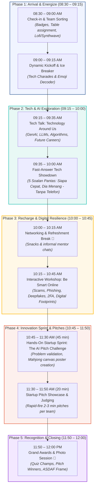

# 📄 01: Event Proposal & Master Schedule

## 1. Executive Summary

- **Event Title:** NextGen Tech Summit: AI, Innovation & Cyber Resilience
- **Tagline:** *Empowering Teens to Master Artificial Intelligence and Navigate the Digital World Safely*
- **Target Audience:** Secondary School Students aged **13 to 17 years old** (Lower & Upper Secondary / Form 1 to Form 5), mixed gender
- **Target Attendance:** 30 – 80 participants (divided into mixed-gender teams of 5–7 members)
- **Venue Requirement:** Seminar Hall / Auditorium with cluster round-table seating, high-definition projector, sound system, and stable Wi-Fi.
- **Duration:** Half-Day (8:30 AM – 12:00 PM / 3.5 Hours)
- **Organizer:** Universiti Teknologi Malaysia (UTM) Student Chapters / STEM Outreach Committee

---

## 2. Seminar Objectives & Learning Outcomes

### Objectives
1. **Explore Real-World AI & Tech Frontiers:** Go beyond consumer apps to explore how Generative AI, Large Language Models (LLMs), algorithms, and automation work, and how they shape future careers in tech.
2. **Build Cyber Resilience & Digital Literacy:** Equip teens with vital digital survival skills: identifying deepfakes, resisting social engineering & online scams, configuring 2-Factor Authentication (2FA), and understanding digital footprints.
3. **Foster Innovation & Startup Ideation:** Challenge mixed-gender teams to think like tech entrepreneurs by formulating and pitching an AI-driven solution to real-world community or teen challenges.
4. **Develop Leadership & Communication Skills:** Provide a platform for teens to practice public speaking, teamwork, and critical evaluation in a collegiate university environment.

### Expected Learning Outcomes (By end of the seminar, participants will be able to):
- Critically evaluate AI outputs and understand how machine learning models and recommendation algorithms operate.
- Identify social engineering tactics, account hijacking risks, phishing URLs, and manage strong multi-factor security.
- Understand the permanent nature of digital footprints and navigate online social dynamics responsibly (doxxing, privacy boundaries, cyber ethics).
- Collaborate in diverse, mixed-gender teams to formulate a viable tech concept and pitch it persuasively in under 3 minutes.

---

## 3. Calibrated Master Schedule for Teens (13–17 Years)

| Time Slot | Duration | Session Name | Activity Description & Teen Relevance | Lead / In-Charge |
| :--- | :---: | :--- | :--- | :--- |
| **08:30 – 09:00 AM** | 30 min | **Check-in, Team Sorting & Music** | • Check-in counter & badge collection • Ice-breaking table assignment (mixed-gender and mixed-school mixing) • Upbeat lofi/synthwave tech playlist playing | Registration Team & Student Ambassadors |
| **09:00 – 09:15 AM** | 15 min | **Dynamic Kickoff & Ice Breaker** | • Welcome, house rules & event vibe check • Mini-challenges: *Tech & Meme Trivia* + *Speed Brainstorm Challenge* • Ice-breaker points awarded to team tables | Emcee & Mentors |
| **09:15 – 09:35 AM** | 20 min | **Tech Talk: “Technology Around Us”** | • Real-world Generative AI (ChatGPT, Midjourney, Claude, Gemini) • Algorithms of TikTok, Instagram & YouTube • Emerging careers: Prompt Engineering, Cybersecurity, Cloud & Robotics | Keynote Speaker (Lecturer / Industry / UTM Senior) |
| **09:35 – 10:00 AM** | 25 min | **Fast-Answer Tech Showdown: “Siapa Cepat, Dia Menang!”** | • 5 soalan kuiz interaktif dipaparkan di skrin utama (tanpa perlu telefon bimbit) • Format pantas: Emcee kira *“3, 2, 1... Angkat Tangan!”* — siapa paling laju, jawab & menang • Ganjaran mata meja / cenderahati segera bagi jawapan tepat | Emcee & Floor Spotters |
| **10:00 – 10:15 AM** | 15 min | **Networking & Refreshment Break** | • Snacks and drinks • Informal chat with UTM university student facilitators about campus life and computing degrees | Catering & Facilitators |
| **10:15 – 10:45 AM** | 30 min | **Interactive Workshop: “Be Smart Online”** | • Case studies: Account theft, impersonation scams, phishing links • Deepfakes & digital footprint: How past posts impact university/job applications • Safe boundaries: Doxxing, cyberbullying, and securing private accounts | Cyber Safety Trainer / Speaker |
| **10:45 – 11:30 AM** | 45 min | **Hands-On Startup Sprint: “The AI Pitch Challenge”** | • Teams act as mini tech startups solving teen/community issues (e.g., Study Stress AI, Green Campus Drone, Scam Shield) • Design an executive pitch poster on Mahjong paper • Mentors guide business model, features, and presentation strategy | Team Mentors |
| **11:30 – 11:50 AM** | 20 min | **Startup Pitch Showcase & Judging** | • 5–8 teams deliver rapid-fire 2–3 min pitches • Judging panel provides encouraging feedback • Awards: *Best Innovation*, *Best Business Model*, *Best Pitch Delivery* | Judges & Emcee |
| **11:50 – 12:00 PM** | 10 min | **Honorary Awards, Closing & Group Photo** | • Announcement of Honorary Titles (Quiz Showdown Champions & Pitch Awards) • Penyerahan Bingkai Penghargaan Khas kepada ASDAF • Grand group photo session | Program Director & Media Crew |

### 3.1 Visual Master Timeline & Activity Flow

---

## 4. Key Engagement Strategies for Teens

1. **Collegiate Atmosphere:** Treat participants as emerging young adults, not kids. Use adult-level tech terminology with clear explanations.
2. **Balanced Mixed-Gender Dynamics:** Ensure equal representation in leadership roles within teams (e.g., project lead, lead designer, lead presenter).
3. **Meme & Pop-Culture Relevance:** Use recognizable examples (Discord, Steam, TikTok, Instagram, Roblox studio, AI music, ChatGPT).
4. **Active University Mentorship:** Pair each table with an energetic undergraduate student mentor who acts as an older sibling/advisor rather than a teacher.
