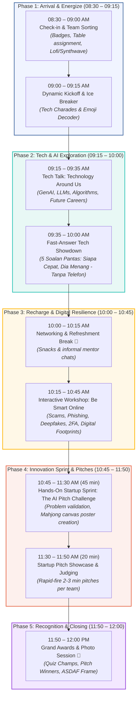
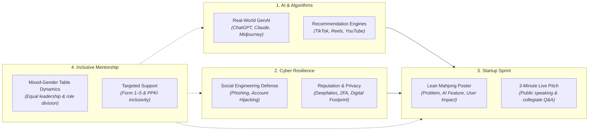
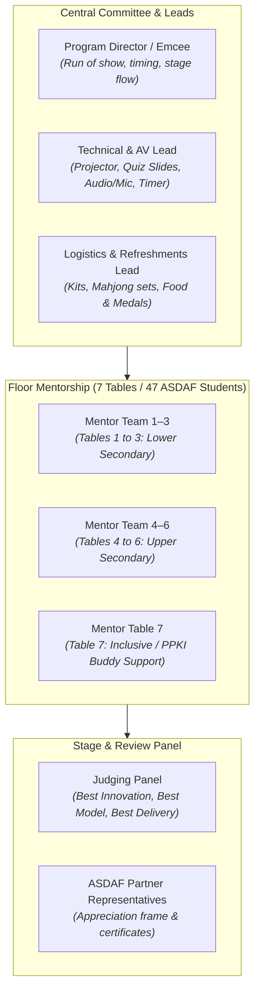

# 📊 10: Visual Plan & Master Flow Diagrams

Dokumen ini menyediakan gambaran visual lengkap bagi **NextGen Tech Summit** merangkumi aliran masa, tiang pembelajaran, dan struktur operasi.

---

## 1. Master Event Flow & Timeline (08:30 – 12:00)

---

## 2. Core Pillars & Participant Learning Journey

---

## 3. Operational Structure & Stakeholder Alignment

