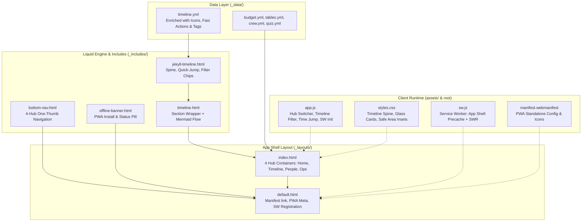

# Jekyll Timeline & Mobile-First PWA Implementation Plan

> **For agentic workers:** REQUIRED SUB-SKILL: Use superpowers:subagent-driven-development to implement this plan task-by-task. Steps use checkbox (`- [ ]`) syntax for tracking.

**Goal:** Implement an interactive, include-based Jekyll timeline component (`_includes/jekyll-timeline.html`) with category filters, quick-jump time anchors, glowing milestone nodes, and mentor action prompts, while restructuring the wiki into a Mobile-First App Shell (4 Core Hubs + Bottom Nav) and 100% offline-resilient Progressive Web App (PWA).

**Architecture:** A native Jekyll Liquid and Vanilla CSS/JS architecture that maintains zero gem dependencies for 100% GitHub Pages compatibility. The timeline data in `_data/timeline.yml` is enriched with categories, icons, mentor action items, and material requirements. The main view in `index.html` is consolidated into 4 tabbed hubs accessible via a fixed mobile bottom navigation bar, and offline support is provided via a standard Service Worker with `StaleWhileRevalidate` caching and W3C Web App Manifest.

**Architecture Diagram:**



**Tech Stack:** 
- Jekyll Static Site Generator (Liquid Templating)
- Vanilla CSS3 (Custom Glassmorphism, CSS Grid, Flexbox, Mobile Viewports)
- Vanilla JavaScript (ES6+, Service Worker API, LocalStorage, DOM Events)
- Lucide Icons & Mermaid.js
- W3C Web App Manifest & CacheStorage API

**Spec:** [`docs/superpowers/specs/2026-09-07-mobile-pwa-design.md`](file:///c:/Users/lezas/OneDrive/UTM/Courses/seminar/docs/superpowers/specs/2026-09-07-mobile-pwa-design.md)

## Global Constraints

- **Formula Pax Rasmi:** 47 Pelajar + 6 Staf ASDAF + 13 Kru UTM = 66 Pax Asas; 66 + 5 Buffer = 71 Pax Jamuan.
- **Sifar Gajet (Zero-Device Requirement):** Kuiz pentas dikawal tanpa telefon pelajar; fasilitator guna web/PWA untuk panduan masa & soalan.
- **PPKI Inklusiviti:** 4 pelajar PPKI di Meja 1, 4, 5, 6 kekal diberi panduan khusus dalam tindakan fasilitator.
- **Sifar Permata Ruby Luar (Zero External Ruby Gems):** Mesti berjalan lancar di GitHub Actions (`.github/workflows/deploy.yml`) dan GitHub Pages tanpa gem tambahan.
- **PWA Scope & Relative Paths:** Semua laluan Service Worker, manifest, dan aset mesti menyokong base URL `{{ '/' | relative_url }}` (`/IT-SEminar/`).

---

### Task 1: Enrich Timeline Data with Icons, Categories, and Facilitator Prompts

**Files:**
- Modify: `_data/timeline.yml`

**Interfaces:**
- Consumes: Existing schedule items (08:30 to 13:00)
- Produces: Enriched YAML schema containing `id`, `start_time`, `category`, `category_label`, `icon`, `location`, `fasi_action`, and `materials`

- [ ] **Step 1: Inspect and update `_data/timeline.yml`**
Add structured fields for each of the 8 event slots:
- `slot-0830`: `category: persediaan`, `icon: clipboard-check`
- `slot-0900`: `category: majlis`, `icon: sparkles`
- `slot-0920`: `category: modul`, `icon: cpu`
- `slot-1020`: `category: rehat`, `icon: coffee`
- `slot-1045`: `category: modul`, `icon: shield-check`
- `slot-1145`: `category: kuiz`, `icon: zap`
- `slot-1215`: `category: majlis`, `icon: award`
- `slot-1245`: `category: rehat`, `icon: utensils`

- [ ] **Step 2: Verify YAML syntax and data integrity**
Run a PowerShell command or ruby/python script to validate that `_data/timeline.yml` is valid YAML.
Expected: Exits with code 0 and valid key count.

- [ ] **Step 3: Commit**
```bash
git add _data/timeline.yml
git commit -m "feat(timeline): enrich timeline dataset with categories, icons, and mentor action prompts"
```

---

### Task 2: Build `jekyll-timeline.html` Component & Overhaul Timeline UI/UX

**Files:**
- Create: `_includes/jekyll-timeline.html`
- Modify: `_includes/timeline.html`
- Modify: `assets/css/styles.css`
- Modify: `assets/js/app.js`

**Interfaces:**
- Consumes: `site.data.timeline`
- Produces: 
  - Quick-jump time anchor strip (`.timeline-quick-jump`)
  - Category filter pills (`.timeline-filter-btn`)
  - Vertical connecting spine track (`.timeline-spine`)
  - Glowing milestone node icons (`.timeline-node`)
  - Mentor Action alert boxes (`.timeline-fasi-action`)
  - Live session indicator (`.timeline-live-badge`)

- [ ] **Step 1: Create `_includes/jekyll-timeline.html`**
Write the modular include component featuring:
- Category filter bar: `[Semua]`, `[Modul & Bengkel]`, `[Kuiz & Showdown]`, `[Rehat & Jamuan]`, `[Majlis & Persediaan]`.
- Mobile quick-jump horizontal anchor strip with pills for all 8 time slots.
- Vertical timeline spine track with glowing icon nodes.
- Card details with location tags, duration badge, mentor action alert box, and required materials.

- [ ] **Step 2: Update `_includes/timeline.html`**
Integrate `` while keeping the Mermaid flow diagram and section header.

- [ ] **Step 3: Add Timeline CSS in `assets/css/styles.css`**
Add styles for:
- `.timeline-spine` & `.timeline-track`: Modern glowing line connecting milestone nodes.
- `.timeline-node`: 44px circular glowing badge with Lucide icons.
- `.timeline-quick-jump`: Horizontal scrollable bar with touch-friendly pills.
- `.timeline-filter-bar`: Pill-shaped filter chips with active states.
- `.timeline-fasi-action`: Amber/cyan border highlight for mentor duties.
- `.timeline-item.active-slot`: Pulsing border highlight indicating current session.

- [ ] **Step 4: Add Timeline filtering and quick-jump logic in `assets/js/app.js`**
Functions:
- `filterTimeline(category)`: Toggles visibility with smooth fade.
- `jumpToSlot(slotId)`: Smoothly scrolls to target slot and adds pulse effect.
- `initTimelineLiveTracker()`: Checks device time vs Malaysian time (08:30 - 13:00) to highlight current slot.

- [ ] **Step 5: Verify in browser**
Verify timeline filtering, quick-jump pills, and icon rendering.

- [ ] **Step 6: Commit**
```bash
git add _includes/jekyll-timeline.html _includes/timeline.html assets/css/styles.css assets/js/app.js
git commit -m "feat(timeline): add jekyll-timeline include with category filters, quick-jump, and mentor actions"
```

---

### Task 3: Implement Mobile App Shell Architecture (4 Core Hubs & Bottom Nav)

**Files:**
- Create: `_includes/bottom-nav.html`
- Modify: `_includes/navbar.html`
- Modify: `index.html`
- Modify: `assets/css/styles.css`
- Modify: `assets/js/app.js`

**Interfaces:**
- Consumes: Existing section includes (`hero`, `stats`, `asdaf`, `timeline`, `curriculum`, `tables`, `crew`, `quiz`, `budget`, `operations`, `checklist`)
- Produces: 4 Tabbed Hubs:
  - Hub 1 (`#hub-home`): Hero, Stats, Profil ASDAF, Guideline link
  - Hub 2 (`#hub-timeline`): Timeline Master, Curriculum, Slaid Pembentangan
  - Hub 3 (`#hub-people`): 7 Meja, 13 Kru, Inklusiviti PPKI, Kuiz Showdown
  - Hub 4 (`#hub-ops`): Bajet RM800, Pek Makanan/Dokumen/Goodies, Checklist Interaktif
- Bottom Navigation Bar on `< 768px` devices with instant switching.

- [ ] **Step 1: Create `_includes/bottom-nav.html`**
4-button fixed bottom navigation bar:
- `[⚡ Utama]` (`hub-home`)
- `[⏰ Jadual]` (`hub-timeline`)
- `[🪑 Meja & Kru]` (`hub-people`)
- `[🛠️ Logistik]` (`hub-ops`)

- [ ] **Step 2: Restructure `index.html` into 4 Hub Sections**
Group the 10 includes into the 4 semantic hubs with `.hub-pane` classes.

- [ ] **Step 3: Update `_includes/navbar.html`**
Add desktop hub tabs or link them to the active hub state, and include mobile network status pill.

- [ ] **Step 4: Add Mobile Hub Switching in `assets/js/app.js`**
`switchHub(hubId)` function that updates URL hash (`#hub-home`, `#hub-timeline`, etc.), manages active classes, scrolls to top of hub, and re-renders Lucide icons if needed.

- [ ] **Step 5: Add App Shell & Bottom Nav styles in `assets/css/styles.css`**
Styles for `.bottom-nav`, `.hub-pane`, `.hub-tab-bar`, and safe area insets for iOS/Android home indicators.

- [ ] **Step 6: Verify responsive layout**
Verify switching between all 4 hubs on both mobile (< 768px) and desktop (> 768px).

- [ ] **Step 7: Commit**
```bash
git add _includes/bottom-nav.html _includes/navbar.html index.html assets/css/styles.css assets/js/app.js
git commit -m "feat(uiux): consolidate 10 sections into 4-hub mobile app shell with bottom nav bar"
```

---

### Task 4: Progressive Web App (PWA) Integration (Manifest, Service Worker & Offline Cache)

**Files:**
- Create: `manifest.webmanifest`
- Create: `sw.js`
- Create: `assets/icons/icon.svg`
- Create: `_includes/offline-banner.html`
- Modify: `_layouts/default.html`
- Modify: `assets/js/app.js`
- Modify: `assets/css/styles.css`

**Interfaces:**
- Consumes: App shell URLs, relative paths from Jekyll
- Produces: 
  - Installable W3C PWA Manifest
  - Offline-first Service Worker with App Shell precache & StaleWhileRevalidate runtime caching
  - Online/Offline status pill (`🟢 Dalam Talian` / `📶 Mod Luar Talian`)
  - "Pasang Aplikasi" (Add to Home Screen) install prompt banner

- [ ] **Step 1: Create `manifest.webmanifest`**
Configure name, short name, start URL (`/IT-SEminar/`), scope (`/IT-SEminar/`), theme colors, and icons.

- [ ] **Step 2: Create App Vector Icon `assets/icons/icon.svg`**
Create clean modern SVG branding icon (NextGen Tech Summit AI chip).

- [ ] **Step 3: Create Service Worker `sw.js`**
Implement cache versioning (`nextgen-v1`), precache of App Shell (`index.html`, `styles.css`, `app.js`, `manifest.webmanifest`), and `StaleWhileRevalidate` network/cache strategy for offline reliability.

- [ ] **Step 4: Create `_includes/offline-banner.html` and update `_layouts/default.html`**
Include manifest link, apple-touch-icon, and offline banner include in `default.html`.

- [ ] **Step 5: Register Service Worker and PWA Install Prompt in `assets/js/app.js`**
Add `navigator.serviceWorker.register`, `online`/`offline` event listeners, and `beforeinstallprompt` event handler.

- [ ] **Step 6: Test PWA offline behavior in browser**
Toggle offline mode in DevTools to verify that the app loads seamlessly and offline banner displays.

- [ ] **Step 7: Commit**
```bash
git add manifest.webmanifest sw.js assets/icons/icon.svg _includes/offline-banner.html _layouts/default.html assets/js/app.js assets/css/styles.css
git commit -m "feat(pwa): add service worker offline caching, web manifest, and install prompt"
```

---

### Task 5: Final Quality Verification & Production Deployment to GitHub Pages

**Files:**
- Review: all modified and created files
- Git commit & push: to `origin main`

- [ ] **Step 1: Run comprehensive verification**
- Verify pax formula: 47 + 6 + 13 = 66, 66 + 5 = 71.
- Verify zero-device Kuiz Showdown.
- Verify 4 PPKI students across Tables 1, 4, 5, 6.
- Verify no broken Liquid tags or syntax errors.
- Verify browser rendering and mobile responsive shell.

- [ ] **Step 2: Push to `main` branch to trigger GitHub Actions deployment**
```bash
git push origin main
```

- [ ] **Step 3: Verify GitHub Pages deployment**
Check live site at `https://xzrians.github.io/IT-SEminar/`.
